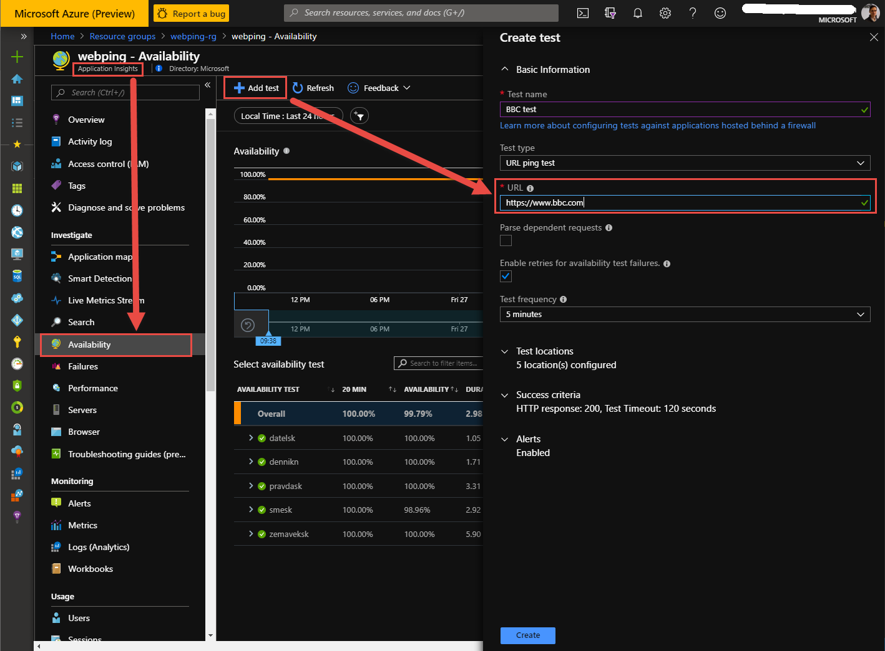

# ApplicationInsightsWebTest

If you need to monitor the availability of any website you can use Azure Appication Insights service. This service allows you to monitor availability and responsivness of any HTTP/HTTPS endpoints that is accessible from the public internet. You do not have to make any changes to the website you're planning to test. Moreover, You do not need to be a site owner.

This sample describe how to create and deploy web test throught ARM templates.

ARM template will do the same action as it is showed on the following picture:
<p align="center">
  
</p>

#How to run ARM template

**Install Azure CLI** 

Login into Azure 
```ruby
az login
```
If you need to change azure subcription run
```ruby
az account set --subscription XXXX-XXXX-XXXX-XXXX
```
Create **Resource Group** and **Azure Application Insights** service
```ruby
az group create -n webtest-rg -l westeurope
az monitor app-insights component create --app applicationmonitoring --location westeurope --kind web -g webtest-rg --application-type web
```

Deployment of ARM templates 'https://www.portal.azure.com'
```ruby
az group deployment create -g webtest-rg --template-file webtest.json --parameters appName=applicationmonitoring webTestName=protal-azure-com  URL=https://www.portal.azure.com 
```
